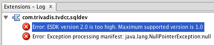

# Frequently Asked Questions

## I cannot install any extension on macOS

Maybe you’ve run into a SQL Developer bug on macOS. See [this blog post](https://www.salvis.com/blog/2015/05/05/cannot-install-extensions-in-sql-developer-4-on-mac-os-x/) for problem details and solution.

## I cannot install any extension on Windows

Have you installed SQL Developer in `C:\Program Files` or `C:\Program Files(x86)`? In this case the files are read-only for a standard Windows user.

To solve the problem start SQL Developer as Administrator or install SQL Developer in an user folder. While the former requires local administrator rights, the latter is always feasible.

## I’ve got errors in the extensions log after installation. What’s wrong?

You are probably using an outdated version of SQL Developer. In this case you see after a restart an error message in the Extensions-Log similar to the following:

SQL Developer 1.x, 2.x and 3.x are based on the Extension Software Development Kit (ESDK) version 1. SQL Developer 4.x requires the use of ESDK version 2. Unfortunately these versions are not compatible. So we decided to support the newest SQL Developer version only.

Please update to SQL Developer 4.x or later since this is a prerequisite for this extension.

## What are the limitations?

See [parser limitations](https://github.com/Trivadis/plsql-cop-cli/blob/main/parser-limitations.md) and [validator limitations](https://github.com/Trivadis/plsql-cop-cli/blob/main/validator-limitations.md).

## What has changed in the latest version?

See the [release information](https://github.com/Trivadis/plsql-cop-sqldev/releases) for each version.

## What is the difference between "db\* CODECOP" and "db\* CODECOP for SQL Developer"?

*db\* CODECOP* is a standalone command line utility. It processes SQL*Plus scripts within a directory tree and produces an HTML report and an Excel workbook. It reports metrics on file and PL/SQL unit level as well as violations of the [Trivadis PL/SQL & SQL Coding Guidelines Version 4.0](https://trivadis.github.io/plsql-and-sql-coding-guidelines/v4.0/).

*db\* CODECOP for SQL Developer* is a cost-free extension to Oracle’s SQL Developer. It processes the content of an editor window and produces a HTML report which is similar to the one of db\* CODECOP but reduced and adapted to the scope of a single editor window. Additionally the violations of the [Trivadis PL/SQL & SQL Coding Guidelines Version 4.0](https://trivadis.github.io/plsql-and-sql-coding-guidelines/v4.0/) are presented in a dedicated tab pane linked to the editor window to support quick navigation to the corresponding code.

## What are the licensing terms?

The preview/trial version of db\* CODECOP is licensed under the Creative Commons Attribution-NonCommercial-NoDerivs 3.0 Unported License. You may obtain a copy of the License at https://creativecommons.org/licenses/by-nc-nd/3.0/.

