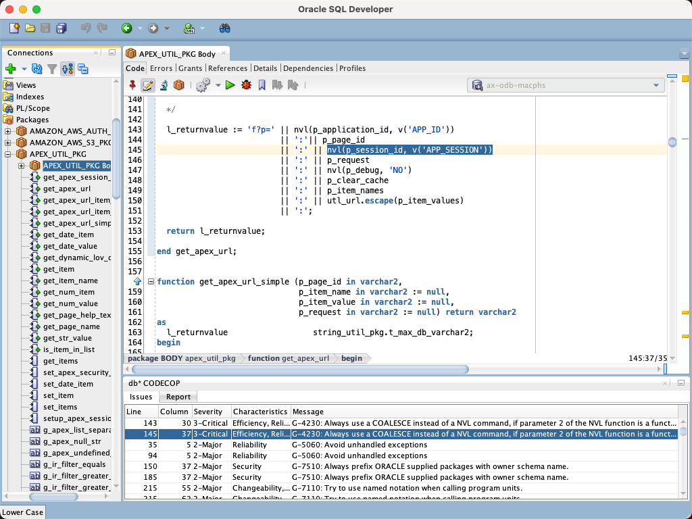
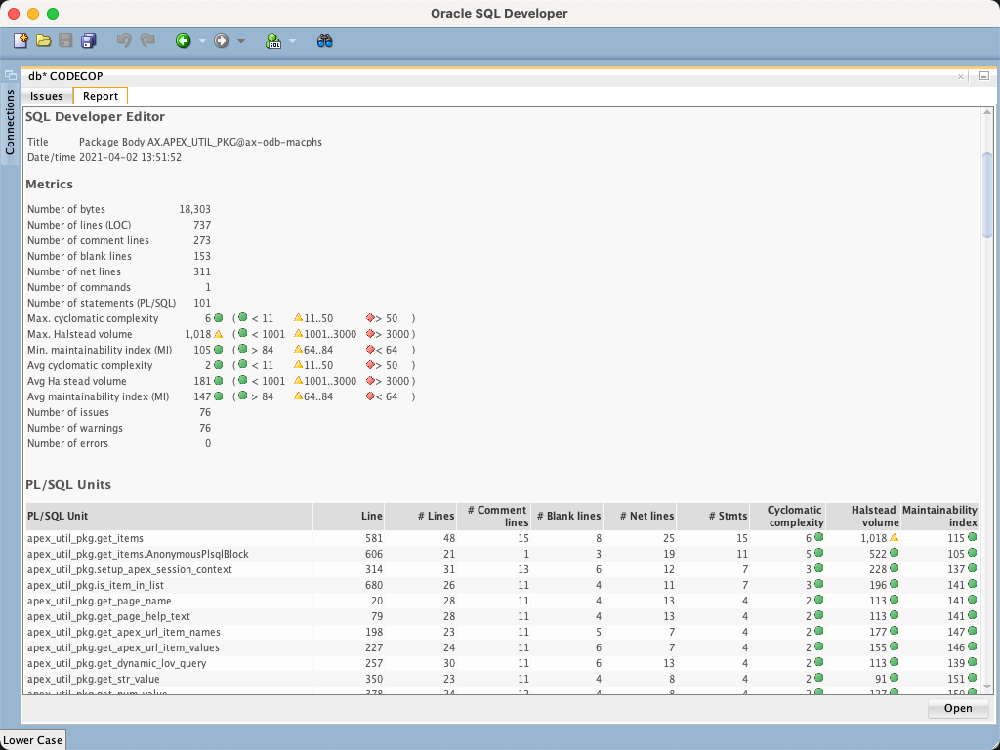

# db\* CODECOP for SQL Developer

## Introduction

db\* CODECOP for SQL Developer is a **free extension** to check an editor content for compliance violations of the [Trivadis PL/SQL & SQL Coding Guidelines Version 4.4](https://trivadis.github.io/plsql-and-sql-coding-guidelines/v4.4/).

db\* CODECOP calculates metrics per PL/SQL unit, such as:

- McCabe’s cyclomatic complexity
- Halstead’s volume
- The maintainability index
- Lines
- Commands (SQL*Plus and SQL)
- Statements (within a PL/SQL unit)
- etc.

And aggregates them on file level.

The results are presented in an additional tabbed panel. One tab shows all guideline violations to quickly navigate to the corresponding code position. The other tab contains a full HTML report, which also may be opened in your external browser.

## Examples

Open a PL/SQL or SQL script in a SQL Developer editor and press Ctrl-Shift-C to check your code against the Trivadis PL/SQL & SQL guidelines.

Navigate through the issues using the cursor keys to highlight the related code section in the linked editor.

Dock the db\* CODECOP output window on your favorite position within SQL Developer and click on the report tab to reveal some additional metrics. Open the report in an external browser to print or save the report.

## Configure Update Center

Click the `Help` menu and select `Check for Updates…`. Press the `Add` button to register the update center http://update.salvis.com/ . If you have troubles to configure the proxy settings, because your company requires some additional authentication or similar, then I suggest to download db\* CODECOP for SQL Developer from [here](https://github.com/Trivadis/plsql-cop-sqldev/releases) and use the `Install From Local File` option.

## Releases

You find all releases and release information [here](https://github.com/Trivadis/plsql-cop-sqldev/releases).

## Frequently Asked Questions

see [Frequently Ased Questions](FAQ.md).

## License

db\* CODECOP for SQL Developer is licensed under the Creative Commons Attribution-NonCommercial-NoDerivs 3.0 Unported License. You may obtain a copy of the License at https://creativecommons.org/licenses/by-nc-nd/3.0/.

